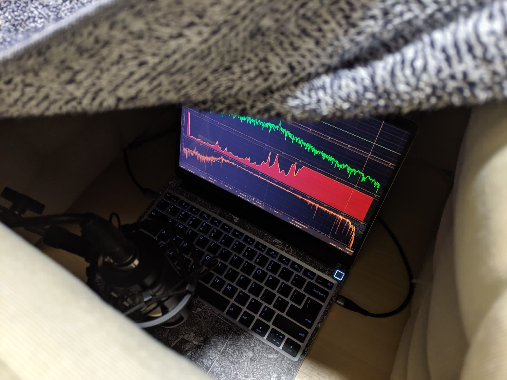

EasyEffects Framework DSP profiles
=======

There's a [progress thread](https://community.frame.work/t/guide-yet-another-easyeffects-profile/40509/) on Framework community forum.

## Installing

For a change, not a `curl | bash`, but a `curl | unzip`. Paste in your terminal and you should be good to go.

```bash
TMP=$(mktemp -d) && \
    CFG=${XDG_CONFIG_HOME:-~/.config}/easyeffects
    curl -Lo $TMP/fwdsp.zip https://github.com/cab404/framework-dsp/archive/refs/heads/master.zip && \
    unzip -d $TMP $TMP/fwdsp.zip 'framework-dsp-master/config/**/*' && \
    sed -i 's|%CFG%|'$CFG'|g' $TMP/**/*.json && \
    cp -rv $TMP/framework-dsp-master/config/* $CFG && \
    rm -rf $TMP
```

## EEGuide+Exciter

I've made it using [this guide](https://wwmm.github.io/easyeffects/guide_1.html), and then plopped an exciter plugin on top to get more highs.

Problem with this one is that resonance frequencies are not negated completely, and speakers do vibrate from time to time, even if a lot less than on baseline settings.

## HifiScan+EEGuide
_(I use this one now)_

Some time later, Tim suggested me to try [HifiScan](https://github.com/erdewit/HiFiScan), and I did.


_image is just to show my measuring configuration, this is not the resulting IRS_

After some tinkering with IRS, I've settled on 5dB correction, just to get the resonance frequencies out, and not to remove all the volume.

I've deleted exciter (cause IMO it sounds better without it with convolver in place), and re-tuned compressor.

I like how it more than the previous one, but maybe it's the hours spent on packaging, running and fiddling around this new profile talking. 
So try it yourself!

## Why not eq?

Read [EEGuide]((https://wwmm.github.io/easyeffects/guide_1.html)), but tl;dr — smallness of your speakers is not something you can just tune out.